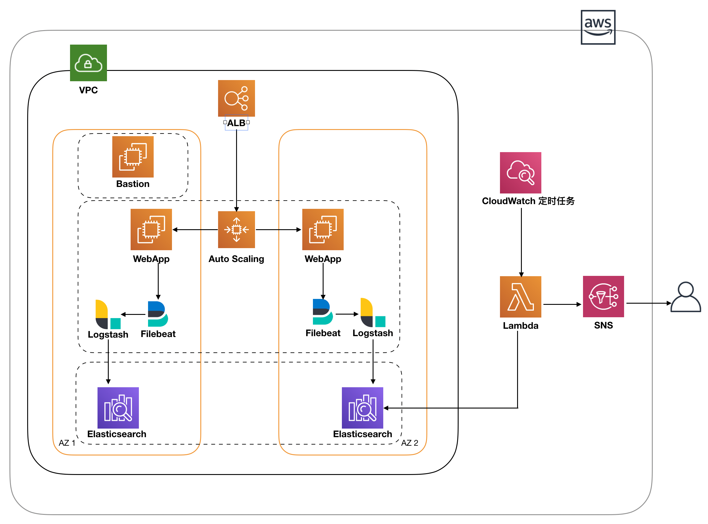
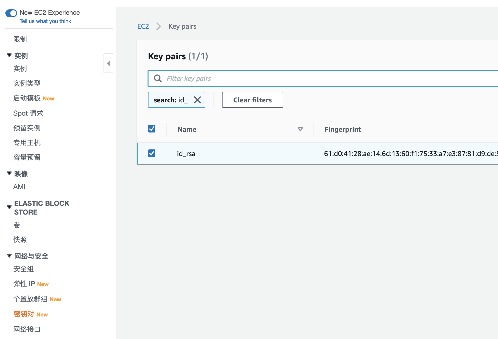
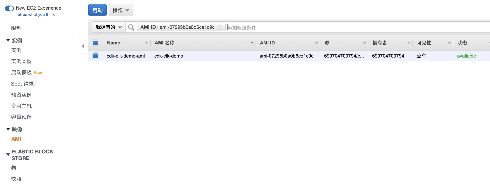
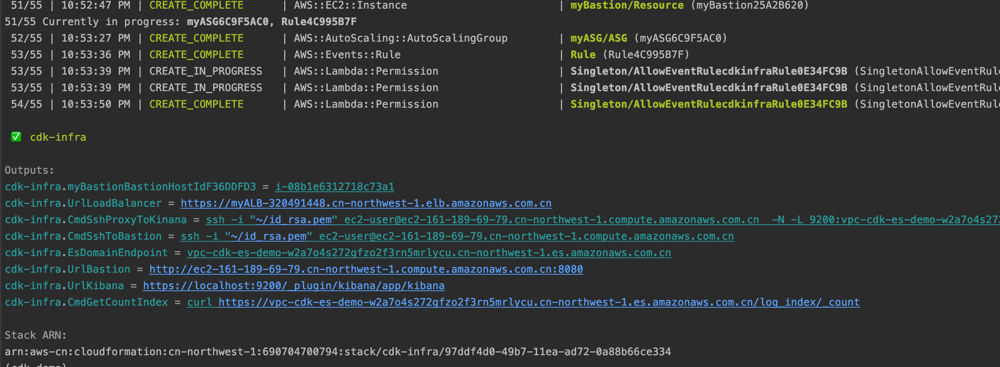
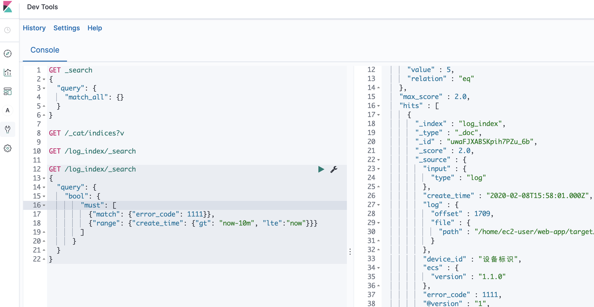
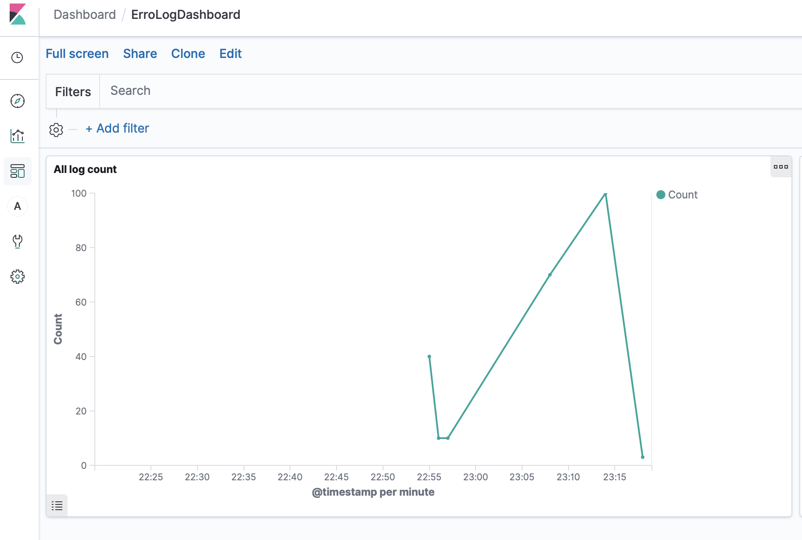
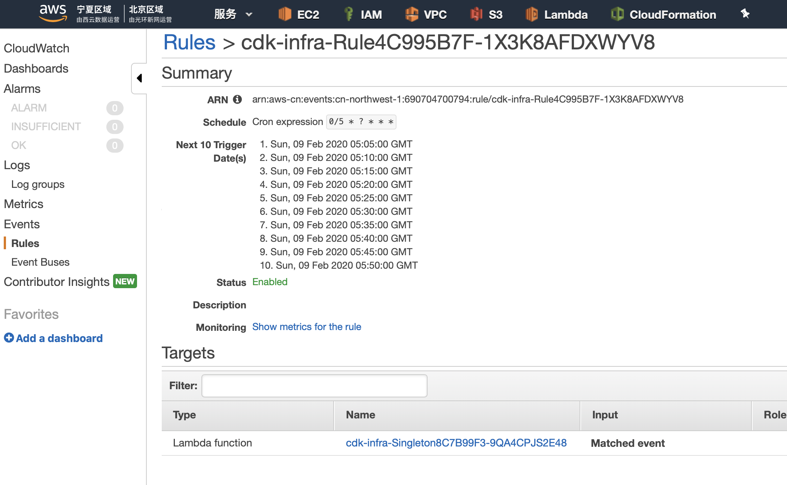

# 免责说明

建议测试过程中使用此方案，生产环境使用请自行考虑评估。
当您对方案需要进一步的沟通和反馈后，可以联系 nwcd_labs@nwcdcloud.cn 获得更进一步的支持。
欢迎联系参与方案共建和提交方案需求, 也欢迎在 github 项目issue中留言反馈bugs。


# 项目介绍

  本项目是演示如何用AWS CDK快速搭建基于 Elasticsearch + Logstash + Filebeat + Kinaba 的日志分析报警系统。 
  
  
# 项目架构图
  
  
  
  
# 项目模块说明

### [web-demo 模块](./web-demo/)

  一个简单的Java Springboot项目， 有一个Log生成的接口， 通过浏览器访问， 可以生成指定数量的log 。 
  

### [Logstash 模块](./logstash/)

  Logstash + Filebeat 的安装和使用方法，以及如何制作镜像。
  

### [cdk-infra](./cdk-infra/)

  CDK 基础环境生成模块， 如前面架构图中用的的AWS 服务 都会自动生成。 
  


# 使用步骤

### 1. 配置秘钥&权限  
登录堡垒机用到的秘钥， 请选择对应的区域生成，并妥善保管， 名称默认是id_rsa, 如果修改成其他名称， 请到[constant.py](./cdk-infra/constant.py) 中修改对应名称。 



需要配置 Elastic Search 的相关权限， 如果不添加会有以下出错信息。 
cdk-es-demo (cdkesdemo) Before you can proceed, you must enable a service-linked role to give Amazon ES permissions to access your VPC. 

这是由于在IAM中缺少elasticsearch的角色导致的，在Iam的控制面板中找到创建该角色的地方，但是可以使用CLI的名称创建，命令如下：
```shell script
aws iam create-service-linked-role --aws-service-name es.amazonaws.com --profile 'region'
```
[对 Amazon ES 使用服务相关角色](https://docs.aws.amazon.com/zh_cn/elasticsearch-service/latest/developerguide/slr-es.html)
[使用服务相关角色 官网介绍](https://docs.aws.amazon.com/zh_cn/IAM/latest/UserGuide/using-service-linked-roles.html#create-service-linked-role)


### 2. 镜像制作

如果想用户开发环境， 请参考 [Logstash+ Filebeat镜像制作](./logstash)， 里面有如何使用Logstash 和Filebeat 的介绍。 

如果只做Demo演示， 可以使用公开的AMIID, 请参看 [配置文件中的ami-id](./cdk-infra/constant.py)





### 3. 变量配置

[常量配置](./cdk-infra/constant.py)

```shell script
    # SNS发送消息，接收者的邮箱
    EMAIL_ADDRESS = 'you@email.com'

    # ES 集群的名称
    ES_CLUSTER_NAME = "cdk-es-demo"

    # ES index 名称
    ES_INDEX_NAME = 'log_index'

    # filebeat 监控的日志路径
    ES_LOG_PATH = '/home/ec2-user/web-app/target/logs/*'

    #ec2 秘钥名称， 需要提前创建好，登录ec2需要
    EC2_KEY_NAME = "id_rsa"

    #AMI ID
    EC2_AMI_ID = 'ami-07295b0a0b6ce1c9c'

    #安装的region 名称， 注意这里 cdk deploy --profile 'region' 中的region 保持一致。 
    REGION_NAME = 'cn-northwest-1'
```

配置报警时间， 每隔指定时间， 错误日志的数量达到规定的量， 就会给上面设置的邮箱发送通知
```shell script

 # step 7. Cloud watch event
        rule = events.Rule(
            self, "Rule",
            schedule=events.Schedule.cron(
                minute='0/5',
                hour='*',
                month='*',
                week_day='*',
                year='*'),
        )

```


### 4. 配置CDK 开发环境

如果第一次使用CDK ，请先阅读以下两个文档. 

[CDK 官方文档 ](https://docs.aws.amazon.com/cdk/latest/guide/home.html)
  
[CDK Workshop](https://cdkworkshop.com/)   

  
### 5. 执行CDK 命令

```
$ cdk bootstrap --profile 'region' 

# 部署
$ cdk deploy --profile 'region'

# 销毁
$ cdk destroy --profile 'region'
```
cdk 代码的说明，在[cdk_infra_stack.py](./cdk-infra/cdk_infra/cdk_infra_stack.py) 文件注释中。 

执行成功以后如下图 



### 6. 验证

第一步中生成的秘钥 保存在~/id_rsa.pem 设置权限400

```shell script
chmod 400 ~/id_rsa.pem
```

Cloudformation 输出参数
```text

 ✅  cdk-infra

Outputs:

# ALB 的访问地址， 第一次访问的时候， 要等待一段时间， 需要和AutoScaling建立关联。 
cdk-infra.UrlLoadBalancer = https://myALB-320491448.cn-northwest-1.elb.amazonaws.com.cn

# 堡垒机的web访问地址， 为了调试方便， 在堡垒机上也使用相同的AMI。 
cdk-infra.UrlBastion = http://ec2-161-189-69-79.cn-northwest-1.compute.amazonaws.com.cn:8080

# Elastic Search 统计log 数量， 可以在堡垒机上执行， 快速查看日志数量。
cdk-infra.CmdGetCountIndex = curl https://vpc-cdk-es-demo-w2a7o4s272gfzo2f3rn5mrlycu.cn-northwest-1.es.amazonaws.com.cn/log_index/_count

# 堡垒机的登录命令， 可以直接复制使用
cdk-infra.CmdSshToBastion = ssh -i "~/id_rsa.pem" ec2-user@ec2-161-189-69-79.cn-northwest-1.compute.amazonaws.com.cn

# Elastic Search Endpoint 名称， 默认只能VPC 中添加了指定Role的EC2 可以访问。 
cdk-infra.EsDomainEndpoint = vpc-cdk-es-demo-w2a7o4s272gfzo2f3rn5mrlycu.cn-northwest-1.es.amazonaws.com.cn

# 在堡垒机中启动服务， 用来测试
cdk-infra.CmdSshBastionStartWeb = sudo /home/ec2-user/start.sh vpc-cdk-es-demo-w2a7o4s272gfzo2f3rn5mrlycu.cn-northwest-1.es.amazonaws.com.cn  cn-northwest-1 '/home/ec2-user/web-app/target/logs/*.log' log_index


# 下面这条输出的命令 是通过堡垒机和Elasticsearch 建立隧道， 在本地访问kibana。 
cdk-infra.CmdSshProxyToKinana = ssh -i "~/id_rsa.pem" ec2-user@ec2-161-189-69-79.cn-northwest-1.compute.amazonaws.com.cn  -N -L 9200:vpc-cdk-es-demo-w2a7o4s272gfzo2f3rn5mrlycu.cn-northwest-1.es.amazonaws.com.cn:443
# 执行完上面的命令后， 在浏览器中打开下面的连接
cdk-infra.UrlKibana = https://localhost:9200/_plugin/kibana/app/kibana

```


### 浏览器中打开 ALB 的网址

如下图 点击发送按钮，发送一定数量的log日志， 日志中会随机产生一些错误日志， 当最近时间内有错误日志时，Lambda 会给SNS 发消息。 


### 通过堡垒机和Elasticsearch 建立隧道， 在本地访问kibana。
ssh -i ~/id_rsa.pem ec2-user@ec2-161-189-69-79.cn-northwest-1.compute.amazonaws.com.cn  -N -L 9200:vpc-cdk-es-demo-w2a7o4s272gfzo2f3rn5mrlycu.cn-northwest-1.es.amazonaws.com.cn:443
本地访问：<https://localhost:9200/_plugin/kibana/app/kibana>
window本地如果没有ssh客户端，可以访问<https://github.com/PowerShell/Win32-OpenSSH/releases>

### Kibana 查询界面


查询语句示例
```shell script
GET /log_index/_count

GET /log_index/_search
{
  "query": {
    "bool": {
        "must": [
          {"match": {"error_code": 1111}},
          {"range": {"create_time": {"gt": "now-10m", "lte":"now"}}}
        ]
      }
  }
}


```

### Kibana Dashboard 界面

可以根据需要，绘制图表，如下图所示



### CloudWatch Event 通知事件


每当最近五分钟后错误日志以后， Lambda 会触发SNS 发送邮件通知相关人员， 如下图


  
  
  
  
  
  
# 参考文档

#### [CDK 官方文档 ](https://docs.aws.amazon.com/cdk/latest/guide/home.html)
  
#### [CDK Workshop](https://cdkworkshop.com/)
  
#### [CDK Examples Repository](https://github.com/aws-samples/aws-cdk-examples)
  
#### [CDK python API ](https://docs.aws.amazon.com/cdk/api/latest/python/index.html)

#### [CDK 代码文章合集](https://github.com/eladb/awesome-cdk)

#### [Logstash 官网文档](https://www.elastic.co/guide/en/logstash/current/index.html)

#### [Logstash 官网安装地址](https://www.elastic.co/guide/en/logstash/current/installing-logstash.html)

#### [Filebeat 官方安装地址](https://www.elastic.co/guide/en/beats/filebeat/current/filebeat-installation.html)

#### [amazon_es 插件介绍](https://github.com/awslabs/logstash-output-amazon_es)

#### [amazon_es 插件安装](https://aws.amazon.com/cn/premiumsupport/knowledge-center/cloudfront-logs-elasticsearch/)

#### [Kibana 官方教程](https://www.elastic.co/guide/en/kibana/7.1/tutorial-load-dataset.html)

#### [AWS Elastic Search配置指南](http://aws.amazon.bokecc.com/news/show-1087.html)